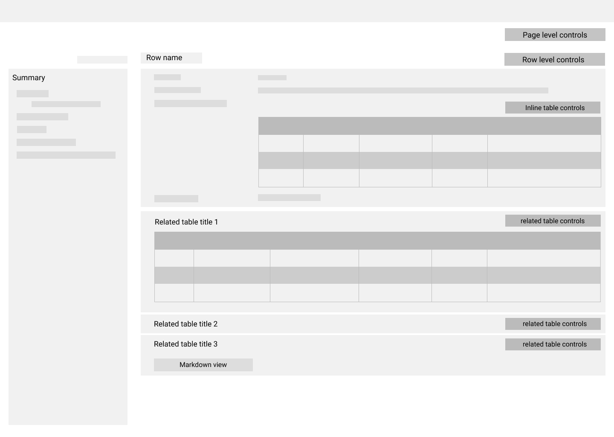

# Record Page

In this section we summarized features of record page. The following are different sections are a record page:

## Related Entities

The list of related entities comes from the `visible-foreign-keys` annotation defined on the main table of the page. Each related entity can have two different display modes:

1. Table View: The default presentation mode for related entities.

2. Markdown View: If the related table has a `row_markdown_pattern` in `compact/breif` context in its `table-display` annotation, this display mode will be activated. It will provide a summary of a page of related entity data to the users. Users can switch to the table mode by clicking on the "Edit" link on top right corner (If users lack edit access to this table, the link caption would be "Table Display").

### Add Related Entity

Users can add new related entities by click on the "Add" button on top right corner of a related entity. Chaise will behave differently based on the related entity type.

- If it's a pure and binary association related entity, Chaise will open a modal picker that will allow users to select entities for the related table.
  - [Associative entities](https://en.wikipedia.org/wiki/Associative_entity) are entities in another table that establish _many-to-many_ relationships between entities. To illustrate this, let's assume table `A` has two foreign keys, one to table `B` and another to `C` (`B <- A -> C`). Then we can say that `C` and `B` are in associative relationship and for a reference that encapsulates `B`, a reference that encapsulates `C` is a related reference. Table `A` must have the following properties to be counted as pure and binary associative table:

    - Should have only two foreign keys (binary).
    - Must have a unique constraint key of the foreign key columns.
    - Cannot have any other unique constraint key (As an exception to this rule, table can have an extra key that is made of one serial type column.).

- Otherwise, Chaise will open a recordedit page in a new tab. In this page, some of the visible data are going to be pre-filled. Chaise will pre-fill any data that is defined by the one-to-one relationship between the parent and related table. This includes,
  - The foreign key relationship that is defining the related table (let's call this foreign key "original").

  - All the foreign keys that are superset of the original foreign key and their extra columns are not-null (let's call these foreign keys "candidate"s). Superset means that it must include all the columns of original foreign key and the mapping must be exactly the same. For example if original foreign key is defined by T1(c1,c2) -> T2(v1,v2), the candidate foreign key must have at least c1 and c2 columns, and in its definition c1 must map to v1 and c2 must map to v2. It could also have any extra not-null columns.

  - All the constituent columns of original and candidate foreign keys.
